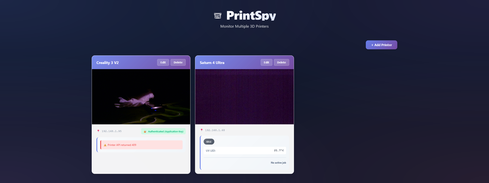

# PrintSpy - 3D Printer Monitor

A modern Next.js application to monitor multiple 3D printers simultaneously with live camera feeds, real-time status updates, and good looking UI.



## Features

- **Multi-Printer Support**: Monitor multiple 3D printers on one page with live camera feeds
- **Printer Type Detection**: Auto-detects OctoPrint, Elegoo, PrusaLink, and Klipper/Moonraker printers
- **Real-Time Status**: Live printer status updates including:
  - Printer state (Operational, Printing, Paused, Error, Idle)
  - Temperature readings (Hotend, Bed, UV LED, Box)
  - Print job progress with completion percentage and time remaining
  - Current print file name
- **SDCP Protocol Support**: Full support for Elegoo resin printers using SDCP over WebSocket
- **RTSP Stream Support**: Automatic RTSP to MJPEG conversion for Elegoo resin printer cameras
- **OctoPrint Integration**: Full support with Application Key authentication
- **Local Storage**: All printer data is saved locally in your browser
- **Edit & Delete**: Easy management of printer entries via modern modal interface
- **Fullscreen Video**: Double-click any camera feed to view in fullscreen
- **No CORS Issues**: Server-side API routes eliminate CORS problems
- **Modern UI**: Beautiful glassmorphism design with smooth animations
- **Responsive Design**: Works on desktop, tablet, and mobile devices

## Supported Printers

### OctoPrint
- **Detection**: Automatic detection via API endpoints
- **Authentication**: Application Key (Bearer token) support
- **Status**: Real-time printer state, temperatures, and job progress
- **Camera**: MJPEG stream support (`/?action=stream`)

### Elegoo
- **Resin Printers** (Saturn 4 Ultra, etc.):
  - SDCP protocol over WebSocket (port 3030)
  - RTSP video streams automatically obtained via SDCP
  - Real-time status including UV LED and box temperatures
  - Print job progress with layer information

### PrusaLink
- **Detection**: Automatic detection via API endpoints
- **Camera**: MJPEG stream support

### Klipper/Moonraker
- **Detection**: Automatic detection via API endpoints
- **Camera**: MJPEG stream support

### Generic/Other
- Support for any camera with MJPEG stream
- Manual IP address and stream path configuration

## Installation

### Prerequisites

- **Node.js** 18+ and npm
- **FFmpeg** (required for RTSP stream support):
  - **Windows**: Download from [ffmpeg.org](https://ffmpeg.org/download.html) and add to PATH
  - **macOS**: `brew install ffmpeg`
  - **Linux**: `sudo apt install ffmpeg` or `sudo yum install ffmpeg`

### Quick Start

1. **Clone or download the repository**

2. **Install dependencies**:
   ```bash
   npm install
   ```

3. **Run the development server**:
   ```bash
   npm run dev
   ```

4. **Open your browser**:
   Navigate to `http://localhost:3000`

5. **Add your first printer**:
   - Click "+ Add Printer" button
   - Enter printer IP address
   - Click "🔍 Detect" to auto-detect printer type
   - For OctoPrint: Enter your Application Key
   - Click "Add Printer"

### Production Build

```bash
npm run build
npm start
```

The app will be available at `http://localhost:3000` (or your configured port).

## Configuration

### OctoPrint Setup

1. **Create an Application Key**:
   - Go to OctoPrint Settings → Application Keys
   - Click "Generate" to create a new key
   - Copy the generated key

2. **Add Printer in PrintSpy**:
   - Select "OctoPrint" as printer type
   - Enter printer IP address
   - Paste the Application Key
   - Click "Add Printer"

### Elegoo Setup

**Resin Printers** (Saturn 4 Ultra, etc.):
- Select "Elegoo" as printer type
- Enter printer IP address
- Leave stream path empty (will be auto-detected via SDCP)
- The app will automatically:
  - Connect via WebSocket (port 3030)
  - Request video stream URL
  - Convert RTSP to browser-compatible MJPEG

## RTSP Stream Support

Elegoo resin printers use RTSP streams which browsers cannot play directly. PrintSpy includes built-in RTSP proxy support that automatically converts RTSP to browser-compatible MJPEG.

### How It Works

1. **Automatic Detection**: When you add an Elegoo resin printer, the app connects via WebSocket (SDCP protocol)
2. **Video URL Retrieval**: The app requests the video stream URL from the printer
3. **Automatic Proxy**: RTSP URLs are automatically routed through `/api/rtsp-proxy`
4. **Real-Time Conversion**: FFmpeg converts RTSP to MJPEG on-the-fly for browser playback

### Requirements

- **FFmpeg** must be installed and accessible in your system PATH
- The RTSP proxy runs automatically - no manual configuration needed

### Troubleshooting RTSP Streams

If video doesn't appear:
1. Verify FFmpeg is installed: `ffmpeg -version`
2. Check browser console for errors
3. Verify printer is powered on and connected to network
4. For Elegoo printers, the video service may be blocked by a previous connection - the app automatically resets the video stream (disables then re-enables) to clear stuck connections

## Usage

### Adding a Printer

1. Click the **"+ Add Printer"** button (top right)
2. **Select printer type** or use "Auto-detect"
3. **Enter the IP address** of your printer
4. Click **"🔍 Detect"** to automatically:
   - Verify the printer is reachable
   - Detect printer type
   - Get available stream paths
   - Auto-fill form fields
5. **For OctoPrint**: Enter your Application Key
6. **Optional**: Add notes or customize stream path
7. Click **"Add Printer"** to save

### Viewing Printer Status

- **OctoPrint**: Shows printer state, hotend/bed temperatures, and print job progress
- **Elegoo**: Shows printer state, UV LED/box temperatures, and print job details
- Status updates automatically every 15 seconds

### Managing Printers

- **Edit**: Click "Edit" on any printer card to modify settings
- **Delete**: Click "Delete" to remove a printer
- **Fullscreen**: Double-click any camera feed to view in fullscreen (press ESC to exit)

### Video Controls

- **Double-click** any camera feed to enter fullscreen mode
- **Press ESC** to exit fullscreen
- Video streams update in real-time

## Project Structure

```
PrintSpy/
├── app/
│   ├── page.tsx              # Main application page (React component)
│   ├── layout.tsx            # Root layout with metadata
│   ├── globals.css           # Global styles and theme
│   └── api/                  # Next.js API routes
│       ├── detect/route.ts   # Printer detection API (handles CORS)
│       ├── status/route.ts   # Printer status API (OctoPrint & Elegoo)
│       └── rtsp-proxy/route.ts # RTSP to MJPEG proxy (uses FFmpeg)
├── elegoo-homeassistant-main/ # SDCP protocol reference (for development)
├── package.json              # Node.js dependencies
├── next.config.js            # Next.js configuration
├── tsconfig.json             # TypeScript configuration
└── README.md                 # This file
```

## API Routes

### `/api/detect`
- **Method**: POST
- **Purpose**: Detect printer type and gather information
- **Handles**: CORS proxying for printer detection

### `/api/status`
- **Method**: POST
- **Purpose**: Get real-time printer status
- **Supports**: OctoPrint (via REST API) and Elegoo (via WebSocket/SDCP)

### `/api/rtsp-proxy`
- **Method**: GET
- **Purpose**: Convert RTSP streams to MJPEG for browser playback
- **Parameters**: `url` - RTSP URL (URL encoded)
- **Returns**: MJPEG stream (multipart/x-mixed-replace)

## Browser Compatibility

- ✅ Chrome/Edge (recommended)
- ✅ Firefox
- ✅ Safari
- ✅ Any modern browser with WebSocket and ES6+ support

## Data Storage

- **Local Storage**: All printer data is stored in browser localStorage (`printspy_printers`)
- **No Cloud**: No data is sent to external servers - all processing happens locally
- **Self-Hosted**: The Next.js server runs on your machine - no external services required
- **Network Required**: The app needs network access to communicate with your printers (local network)
- **Export/Import**: You can manually export/import data via browser DevTools → Application → Local Storage

## Troubleshooting

### Video Stream Not Showing

1. **Check FFmpeg**: Verify FFmpeg is installed (`ffmpeg -version`)
2. **Check Console**: Open browser DevTools (F12) and check for errors
3. **Network**: Verify printer is on the same network and reachable
4. **Elegoo**: The app automatically resets video streams, but you may need to wait a few seconds

### Status Not Updating

1. **OctoPrint**: Verify Application Key is correct
2. **Elegoo**: Ensure printer is powered on and WebSocket server is running (port 3030)
3. **Network**: Check firewall settings

### CORS Errors

- Should not occur with Next.js version (all API calls go through server)
- If you see CORS errors, ensure you're accessing via `http://localhost:3000`

## Development

### Tech Stack

- **Framework**: Next.js 14+ (App Router)
- **Language**: TypeScript
- **Styling**: CSS with CSS Variables
- **State Management**: React hooks (useState, useEffect, useRef, useMemo)
- **WebSocket**: `ws` library for Elegoo SDCP protocol
- **Streaming**: FFmpeg via Node.js child_process

### Key Features Implementation

- **SDCP Protocol**: Custom WebSocket client implementation for Elegoo printers
- **RTSP Proxy**: Real-time RTSP to MJPEG conversion using FFmpeg
- **Status Polling**: Efficient status updates with exponential backoff and retry logic
- **Modal UI**: Modern modal interface for adding/editing printers
- **Responsive Design**: Mobile-first approach with flexible grid layouts

## License

This project is open source and available for personal and commercial use.

## Contributing

Contributions are welcome! Please feel free to submit issues or pull requests.

## Acknowledgments

- SDCP protocol implementation based on [elegoo-homeassistant](https://github.com/danielcherubini/elegoo-homeassistant)
- Built with [Next.js](https://nextjs.org/) and [React](https://react.dev/)

